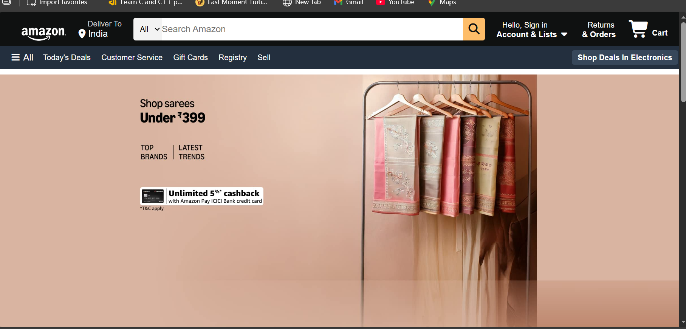
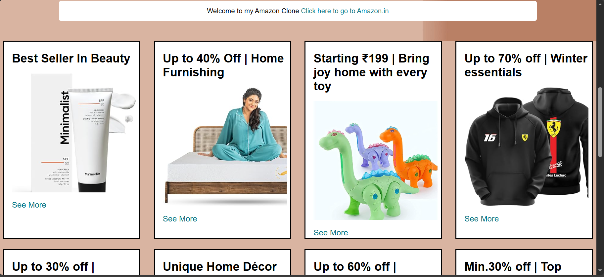
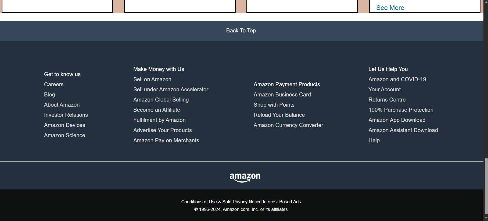

# Amazon Clone 🛒

This is a simple **Amazon website clone** built using **HTML and CSS**.  
The project focuses on recreating the layout and design of Amazon’s homepage to practice frontend fundamentals.

---

## 🔧 Technologies Used

- HTML5  
- CSS3 (Flexbox)

---

## ✨ Features

- Amazon-like homepage layout  
- Navigation bar with logo and search bar  
- Shop section with product boxes (4x2 grid layout)  
- Responsive flexbox-based design  
- Clean UI styling inspired by Amazon

---

## 📂 Project Structure
AmazonClone/
├── index.html
├── style.css
└── Assets
        ├── Screenshot 1.png
        ├── Screenshot 2.png
        └── Screenshot 3.png

---

## Preview

### Homepage

### Shop Section

### Footer / Other Section

---

## How to Run
1. Clone the repository
2. Open `index.html` in your browser

---

## Learning Outcome
- Practiced HTML structure
- Learned CSS Flexbox layout
- Understood Git & GitHub workflow

---

## Author
Gaurav Vennamwar

---

## Note
This project is for learning and practice purposes only.
